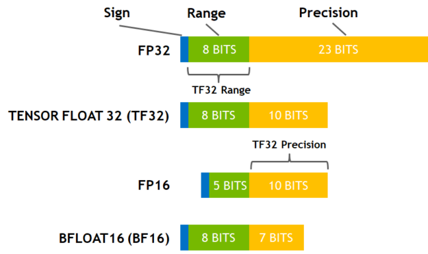

# Precision and Performance

Modern GPU architectures usually can use reduced precision tensor data or computational operations to save memory and increase throughput. However, in some cases, the reduced precision will cause numerical stability issues, and further cause reproducibility issues. Therefore, please ensure that you are using appropriate precision.

<!-- Maybe adding Automatic Mixed Precision, Float16 or BFloat16 in the future-->

## TensorFloat-32 (TF32)

### Introduction

NVIDIA introduced a new math mode TensorFloat-32 (TF32) for NVIDIA Ampere GPUs and above, see [Accelerating AI Training with NVIDIA TF32 Tensor Cores](https://developer.nvidia.com/blog/accelerating-ai-training-with-tf32-tensor-cores/), [TRAINING NEURAL NETWORKS
WITH TENSOR CORES](https://nvlabs.github.io/eccv2020-mixed-precision-tutorial/files/dusan_stosic-training-neural-networks-with-tensor-cores.pdf), [CUDA 11](https://developer.nvidia.com/blog/cuda-11-features-revealed/) and [Ampere architecture](https://developer.nvidia.com/blog/nvidia-ampere-architecture-in-depth/).

TF32 adopts 8 exponent bits, 10 bits of mantissa, and one sign bit.



### Potential Impact

Although NVIDIA has shown that TF32 mode can reach the same accuracy and convergence as float32 for most AI workloads, some users still find some significant effect on their applications, see [PyTorch and TensorFloat32](https://dev-discuss.pytorch.org/t/pytorch-and-tensorfloat32/504). Users who need high-precision matrix operation, such as traditional computer graphics operation and kernel method, may be affected by TF32 precision.

Note that all operations that use `cuda.matmul` may be affected
by TF32 mode so the impact is very wide.

### Settings

[PyTorch TF32](https://pytorch.org/docs/stable/notes/cuda.html#tensorfloat-32-tf32-on-ampere-devices) default value:
```python
torch.backends.cuda.matmul.allow_tf32 = False # in PyTorch 1.12 and later.
torch.backends.cudnn.allow_tf32 = True
```
Please note that there are environment variables that can override the flags above. For example, the environment variables mentioned in [Accelerating AI Training with NVIDIA TF32 Tensor Cores](https://developer.nvidia.com/blog/accelerating-ai-training-with-tf32-tensor-cores/) and `TORCH_ALLOW_TF32_CUBLAS_OVERRIDE` used by PyTorch. Thus, in some cases, the flags may be accidentally changed or overridden.

We recommend that users print out these two flags for confirmation when unsure.

If you are using an [NGC PyTorch container](https://catalog.ngc.nvidia.com/orgs/nvidia/containers/pytorch), the container includes a layer `ENV TORCH_ALLOW_TF32_CUBLAS_OVERRIDE=1`.
The default value `torch.backends.cuda.matmul.allow_tf32` will be overridden to `True`.

If you can confirm through experiments that your model has no accuracy or convergence issues in TF32 mode and you have NVIDIA Ampere GPUs or above, you can set the two flags above to `True` to speed up your model.
